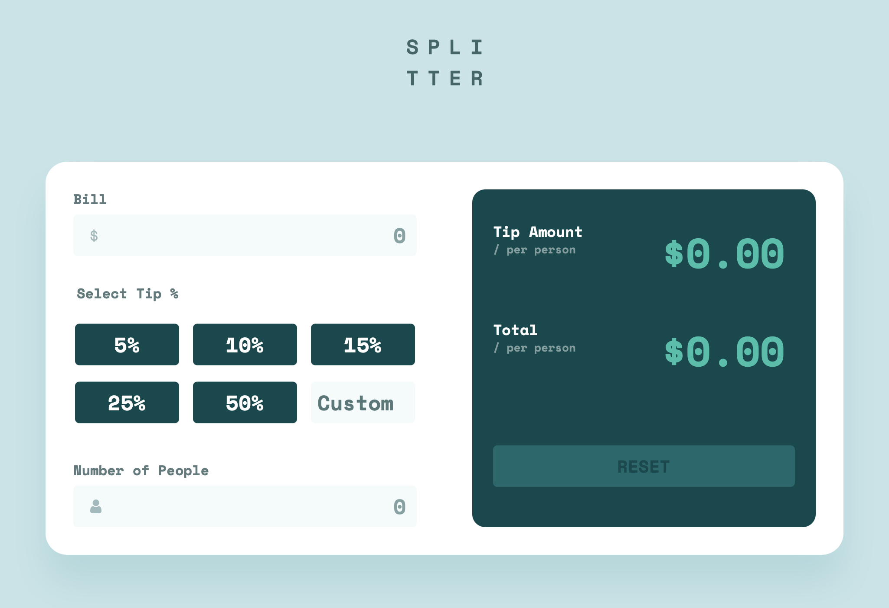

## Table of contents

- [Overview](#overview)
  - [The challenge](#the-challenge)
  - [Screenshot](#screenshot)
  - [Links](#links)
- [My process](#my-process)
  - [Built with](#built-with)
  - [Useful resources](#useful-resources)
- [Author](#author)

## Overview

### The challenge

Users should be able to:

- View the optimal layout for the app depending on their device's screen size
- See hover states for all interactive elements on the page
- Calculate the correct tip and total cost of the bill per person

### Screenshot

### Links

- Repository: [GitHub](https://github.com/dmitrymitenkoff/tip-calculator-app)
- Live: [Tip Calculator App](https://tip-calculator-app-zeta.vercel.app/)

## My process

### Built with

- Semantic HTML5 markup
- CSS custom properties
- SCSS
- Flexbox
- CSS Grid
- Mobile-first workflow
- JavaScript for form validation
- Parcel web app bundler

### Useful resources

- [Submitting and resetting form fields](https://stackoverflow.com/questions/14589193/clearing-my-form-inputs-after-submission/47198786)
- [So. Many. States. ](https://css-tricks.com/so-many-states/)
- [Disabled buttons suck](https://axesslab.com/disabled-buttons-suck/)
- [Form reset Method](https://www.w3schools.com/jsref/met_form_reset.asp)
- [HTMLFormElement.reset](https://developer.mozilla.org/en-US/docs/Web/API/HTMLFormElement/reset)
- [Clear text inputs in JavaScript](https://stackoverflow.com/questions/39759681/clear-text-inputs-in-javascript)
- [Form Validation Styling on Input Focus](https://css-tricks.com/snippets/css/form-validation-styling-on-input-focus/)
- [Constraint Validation in HTML](https://css-tricks.com/form-validation-part-1-constraint-validation-html/)
- [HTML attribute: required](https://developer.mozilla.org/en-US/docs/Web/HTML/Attributes/required)
- [HTMLInputElement](https://developer.mozilla.org/en-US/docs/Web/API/HTMLInputElement)
- [HTMLElement: change event](https://developer.mozilla.org/en-US/docs/Web/API/HTMLElement/change_event)
- [HTMLFormElement: submit event](https://developer.mozilla.org/en-US/docs/Web/API/HTMLFormElement/submit_event#examples)
- [CSS Button Styling Guide](https://moderncss.dev/css-button-styling-guide/)
- [Pure CSS Custom Styled Radio Buttons](https://moderncss.dev/pure-css-custom-styled-radio-buttons/)
- [You probably don’t need input type=“number”](https://css-tricks.com/you-probably-dont-need-input-typenumber/)
- [What to Use Instead of Number Inputs](https://css-tricks.com/what-to-use-instead-of-number-inputs/)
- [I Wanted To Type a Number](https://www.filamentgroup.com/lab/type-number.html)
- [<input type="number">](https://developer.mozilla.org/en-US/docs/Web/HTML/Element/input/number)
- [Finger-friendly numerical inputs with inputmode](https://css-tricks.com/finger-friendly-numerical-inputs-with-inputmode/)
- [Everything You Ever Wanted to Know About inputmode](https://css-tricks.com/everything-you-ever-wanted-to-know-about-inputmode/)
- [Custom CSS Styles for Form Inputs and Textareas](https://moderncss.dev/custom-css-styles-for-form-inputs-and-textareas/)
- [A Modern CSS Reset](https://piccalil.li/blog/a-modern-css-reset/)

## Author

- Twitter - [@walzinthedesert](https://www.twitter.com/walzinthedesert)
